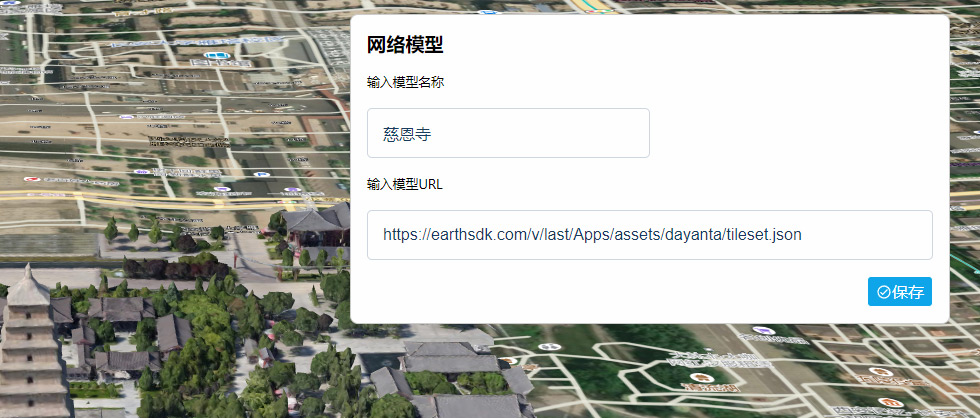

# GisBim 全家桶 说明

# 1. 项目介绍

```
GisBim全家桶是一款强大的桌面应用。它是一个倾斜摄影 3d tiles 模型文件的管理神器，不管是本地电脑文件夹、网络链接，还是 Cesium Ion资产，统统能统一管理并预览，一键下载所有瓦片到本地也没问题。它集成BIM模块，能直接上传、解析、预览和分享几十种格式的三维 BIM 模型文件。
```

# 2. 项目功能

## 2.1 Gis 功能

### 模型管理

- 加载网络 3d tiles 模型
- 加载本地 3d tiles 模型
- 加载 Cesium Ion 资产模型
- 将网络模型下载到本地

### 场景管理

- 创建和修改场景，将模型和图标加入场景
- 预览场景，显示模型和图标，响应图标点击事件
- 配置地图地形
- 配置 Cesium Ion 资产地形
- 配置 Cesium Ion 资产地图
- 配置 Bing Maps 地图
- 配置腾讯地图
- 配置高德地图
- 配置天地图

## 2.2 BIM 功能

- 上传 BIM 模型, 自动解析
- 预览 BIM 模型
- 分享 BIM 模型
- 本地批注 BIM 模型

# 3. 使用帮助

```
先到releases下载最新的安装包 【GisBim全家桶-latest-Setup.exe】，按照提示安装完成即可。
```

[也可以使用短链下载](http://s.c1ns.cn/gis-bim-pack)

启动界面展示的是系统示例数据大屏,如下图所示:


## 3.1 Gis 配置

```
在[配置 - gis配置]页面，你可以配置Cesium参数，包括使用Cesium Ion资产，bing地图，腾讯地图，高德地图，天地图等。
可以复制“其它配置”项，使用同一个地图的不同样式，以便叠加组合使用。
```


## 3.2 图表管理

```
图表用于在Cesium 场景中添加图表。在[配置 - 图表管理]页面，你可以注册、修改、删除图表记录。
界面使用echarts图表，图表记录依靠接口输出echarts图表的optIon数据。
系统内置了6个图表接口，用于示例大屏。
```


## 3.3 图标管理

```
    图标用于在Cesium 场景中添加标注。在[配置 - 图标管理]页面，你可以上传、修改、删除图标记录。
```


## 3.4 Gis 模型管理

### 3.4.1 加载网络模型

```
    在[Gis模型 - 加载网络模型]页面，你可以加载互联网或者局域网服务器上的 3d tiles模型，还可以把这种模型的网片数据下载到本地电脑。
```



### 3.4.2 加载本地模型

```
    在[Gis模型 - 加载本地模型]页面，你可以加载保存在自己电脑上的 3d tiles模型。
```


### 3.4.3 加载 Ion 模型

```
    在[Gis模型 - 加Ion模型]页面，你可以加载保存在Cesium Ion上的模型。使用这种模型，还需要输入Ion的access token。
```


### 3.4.4 模型列表

```
    在[Gis模型 - Gis模型列表]页面，你可以管理和查看所有保存的的模型记录。
```


### 3.4.5 下载网络模型

    对于网络模型，点击[下载]按钮, 可以把所有瓦片数据下载到本地。


## 3.5 Gis 场景

### 3.5.1 配置场景

```
    在[Gis场景 - 配置场景]页面，你可以配置Cesium 场景，在场景中使用模型，图表，标记。
    先点击场景表单弹框中的[模型]、[标记]、[图表]选项卡，然后勾选对应选项的记录，即可加入场景进行编辑。
    模型、标记和图表都可以通过参数表单进行配置，或者拖拽缩放，把它们放置在Cesium 场景中，然后保存。
```


### 3.5.2 场景列表

```
    在[Gis场景 - 场景列表]页面，你可以管理和查看所有保存的的场景记录。 可以设置默认场景，以便在启动时自动加载。
```


## 3.6 BIM 模型管理

### 3.6.1 开放模型

```
    在[BIM模型 - 开放模型]页面，你可以查看所有的开放模型。
    可以预览BIM模型， 进行本地批注。
    也可以复制开放模型的网络链接，分享给他人。
```


### 3.6.2 团队模型

```
    在[BIM模型 - 团队模型]页面，你可以查看团队的模型。
    需要用微信扫码登录后方可访问。
    可以上传BIM 模型文件，然后设置为开放并且分享给他人。
```

### 4 关于我们

- 开发者： aardpro，编程爱好者，虽然菜但是热爱学习和创新。
- 微信： 
- 邮箱： <a href="mailto:aoki-infinity@qq.com">aoki-infinity@qq.com</a>
